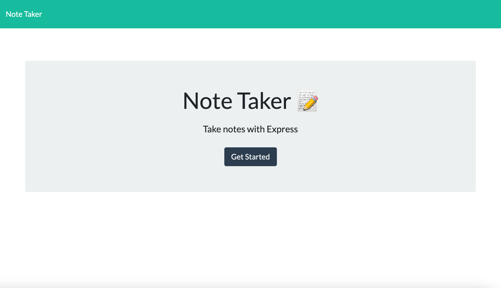
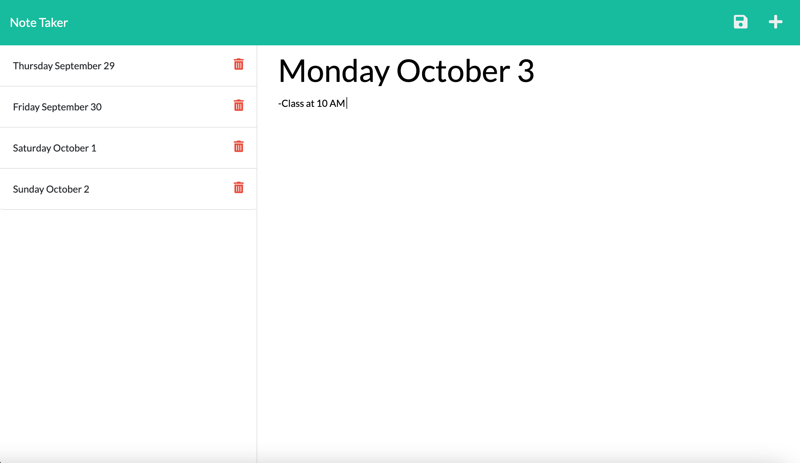

# Note Taker App

## Description 

This app was created to allow an user to enter notes that can be saved via a save button. The saved notes will appear on the left of their page, so that the user can go back and edit them or look at them. There is also a delete button feature that allows the user to delete the notes they no longer need. The user can also add new notes by hitting the plus button on the top right. The user can use this app by going on the Deployment Link URL below. To start taking notes, the user should hit the "Get Started" button the homepage. This will take the user to the note taking page. This application was created by connecting the front end JavaScript to the backend using node.js, express, and fs among other methods. 

## Screenshots

## Deployment Link 

https://aqueous-plateau-30843.herokuapp.com/